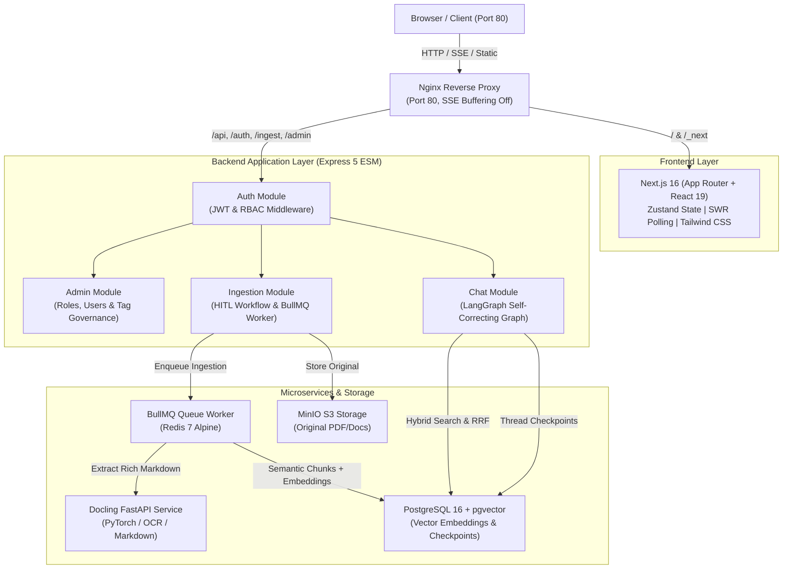
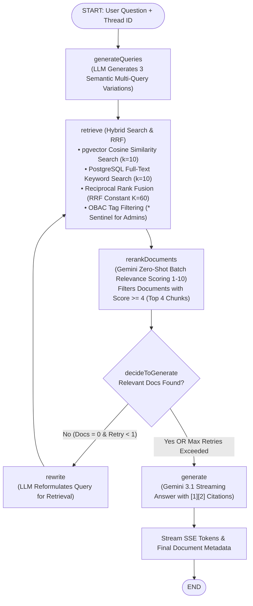
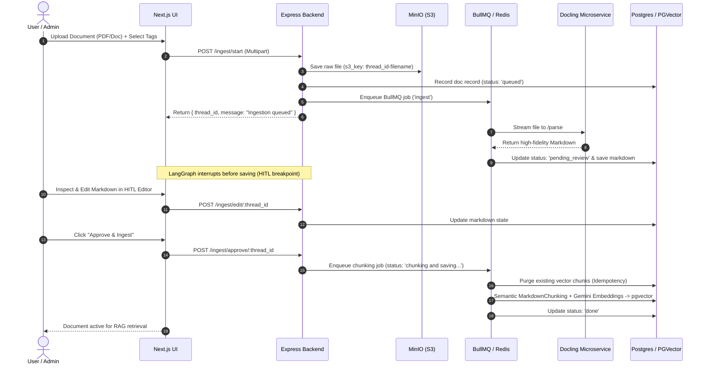
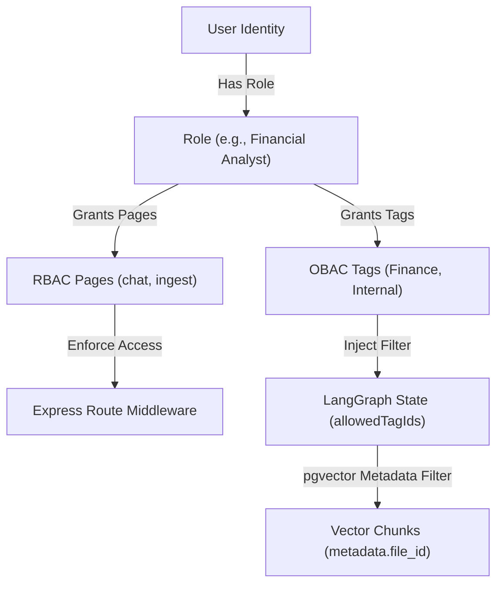

# 🧠 Self-Correcting Agentic RAG Platform

[](https://www.typescriptlang.org/)
[](https://nextjs.org/)
[](https://react.dev/)
[](https://expressjs.com/)
[](https://langchain-ai.github.io/langgraphjs/)
[](https://ai.google.dev/)
[](https://github.com/DS4SD/docling)
[](https://github.com/pgvector/pgvector)
[](https://bullmq.io/)
[](https://min.io/)
[](LICENSE)

A full-stack, enterprise-grade **Self-Correcting Retrieval-Augmented Generation (RAG)** platform. Built with **LangGraph.js**, **IBM Docling**, **Google Gemini**, **PGVector**, **Next.js 16**, and **Express 5**, this repository provides an autonomous document processing pipeline and conversational AI agent with real-time SSE streaming, zero-shot LLM reranking, human-in-the-loop validation, and dual-layer **RBAC & OBAC** security governance.

---

## 📑 Table of Contents

- [Key Architecture & Workflows](#-key-architecture--workflows)
  - [1. System Topology](#1-system-topology)
  - [2. LangGraph Self-Correcting Chat Loop](#2-langgraph-self-correcting-chat-loop)
  - [3. Docling Ingestion & HITL Pipeline](#3-docling-ingestion--hitl-pipeline)
- [Core Features](#-core-features)
- [Repository Structure](#-repository-structure)
- [Prerequisites & Environment Configuration](#-prerequisites--environment-configuration)
- [Step-by-Step Local Development Setup](#-step-by-step-local-development-setup)
  - [Step 1: Start Infrastructure (Postgres, Redis, MinIO)](#step-1-start-infrastructure-postgres-redis-minio)
  - [Step 2: Start Docling FastAPI Service](#step-2-start-docling-fastapi-service)
  - [Step 3: Start Node.js Express Backend](#step-3-start-nodejs-express-backend)
  - [Step 4: Start Next.js Frontend](#step-4-start-nextjs-frontend)
  - [Step 5: Visual Graph Debugging with LangGraph Studio](#step-5-visual-graph-debugging-with-langgraph-studio)
- [Containerized Deployment (Podman / Docker Compose)](#-containerized-deployment-podman--docker-compose)
- [Comprehensive API Reference](#-comprehensive-api-reference)
  - [Authentication (`/auth`)](#authentication-auth)
  - [Chat & Streaming (`/api`)](#chat--streaming-api)
  - [Document Ingestion & HITL (`/ingest`)](#document-ingestion--hitl-ingest)
  - [Admin & Access Governance (`/admin`)](#admin--access-governance-admin)
- [Access Control: RBAC & OBAC Matrix](#-access-control-rbac--obac-matrix)
- [License](#-license)

---

## 🏗 Key Architecture & Workflows

### 1. System Topology



---

### 2. LangGraph Self-Correcting Chat Loop

The conversational agent executes a cyclic state graph with query expansion, hybrid search fusion, batch zero-shot reranking, and autonomous self-correction retry loops:



---

### 3. Docling Ingestion & HITL Pipeline



---

## ✨ Core Features

| Feature | Description |
| :--- | :--- |
| **Self-Correcting RAG** | Autonomous LangGraph workflow with multi-query generation, Reciprocal Rank Fusion (RRF), zero-shot LLM reranking, and self-healing query rewriting fallback loops. |
| **Docling Parser Integration** | High-precision PDF, Doc, and presentation extraction using IBM Docling, converting complex tables and layouts into structured Markdown. |
| **Human-In-The-Loop (HITL)** | Interrupted graph execution allowing users to review, edit, or reject parsed markdown before chunking and embedding. |
| **Dual Access Control (RBAC & OBAC)** | Role-Based Access Control for UI and route navigation paired with Object-Based Access Control enforcing tag-level document isolation during vector retrieval. |
| **Production-Ready Streaming** | Real-time Server-Sent Events (SSE) streaming token-by-token output with node lifecycle events (`retrieve`, `rerankDocuments`, `generate`, `rewrite`) and source attributions. |
| **Asynchronous BullMQ Pipeline** | Non-blocking background worker backed by Redis with automatic retry handling, idempotent vector chunk purging, and explicit failure transitions. |
| **Singleton & Advisory Locks** | Robust database initialization with PostgreSQL advisory locks (`pg_advisory_lock`) to prevent race conditions during multi-process bootstrap. |
| **Visual Graph Studio** | Out-of-the-box compatibility with `@langchain/langgraph-cli` and LangGraph Studio for real-time visual debugging of graphs. |

---

## 📂 Repository Structure

```
.
├── backend/
│   ├── src/
│   │   ├── app.ts                         # Express 5 application setup & middleware
│   │   ├── server.ts                      # Server bootstrap & graceful shutdown hooks
│   │   ├── components/
│   │   │   ├── auth/                      # Authentication domain (JWT, Login, Register, Profile)
│   │   │   ├── admin/                     # RBAC roles, users, and OBAC tag management
│   │   │   ├── chat/                      # Self-correcting RAG LangGraph workflow & SSE routes
│   │   │   └── ingestion/                 # Document ingestion graph, HITL state, & BullMQ handlers
│   │   └── libraries/
│   │       ├── auth/                      # JWT & RBAC/OBAC permission guard middleware
│   │       ├── config/                    # Zod-validated environment configuration
│   │       ├── db/                        # PGVector client, PostgresSaver checkpointer, doc repositories
│   │       ├── error-handling/            # Centralized AppError class & async route wrappers
│   │       ├── queue/                     # BullMQ Redis worker & task queue definitions
│   │       └── storage/                   # MinIO / AWS S3 client wrapper
│   ├── services/
│   │   └── docling-api/                   # FastAPI Python microservice running IBM Docling
│   ├── http/                              # REST client test files (chat.http, upload.http)
│   ├── langgraph.json                     # LangGraph CLI & Studio configuration
│   └── package.json
├── frontend/
│   ├── src/
│   │   ├── app/                           # Next.js 16 App Router pages (/chat, /ingest, /admin, /login)
│   │   ├── features/                      # Domain feature modules (components, Zustand store, SWR hooks)
│   │   ├── components/                    # Reusable UI component library (Modals, Badges, Buttons)
│   │   ├── lib/                           # Axios client, auth helpers, and utilities
│   │   └── types/                         # TypeScript interfaces and shared models
│   └── package.json
├── nginx/
│   └── nginx.conf                         # Ingress reverse proxy configuration with SSE unbuffered streaming
├── docker-compose.yml                     # Multi-service Podman / Docker Compose orchestration
└── README.md
```

---

## ⚙️ Prerequisites & Environment Configuration

### Prerequisites

- **Node.js**: `v20.x` or `v22.x`
- **Python**: `3.10` or `3.11` (for Docling microservice)
- **Container Engine**: [Podman](https://podman.io/) (recommended) or [Docker](https://www.docker.com/)
- **Google Gemini API Key**: Obtainable from [Google AI Studio](https://aistudio.google.com/)

### Environment Variables Matrix

Copy the template in `backend/.env.example` to `backend/.env` and update the parameters:

```bash
cp backend/.env.example backend/.env
```

| Variable | Type | Default | Description |
| :--- | :---: | :---: | :--- |
| `PORT` | Number | `3000` | Express backend listening port |
| `GOOGLE_API_KEY` | String | **Required** | Google Gemini API Key for embeddings and chat generation |
| `GOOGLE_MODEL` | String | `gemini-3.1-flash-lite` | Gemini model variant used for generation and reranking |
| `DOCLING_SERVICE_URL` | URL | `http://docling-service:8000` | URL of the Docling FastAPI microservice |
| `DB_HOST` | String | `pgvector` / `localhost` | PostgreSQL host |
| `DB_PORT` | Number | `5432` | PostgreSQL port |
| `DB_USER` | String | `raguser` | PostgreSQL database user |
| `DB_PASSWORD` | String | `ragpassword` | PostgreSQL database password |
| `DB_NAME` | String | `rag_db` | PostgreSQL database name |
| `REDIS_HOST` | String | `redis` / `localhost` | Redis server host for BullMQ queues |
| `REDIS_PORT` | Number | `6379` | Redis server port |
| `MINIO_ENDPOINT` | String | `minio` / `localhost` | MinIO host |
| `MINIO_PORT` | Number | `9000` | MinIO API port |
| `MINIO_ACCESS_KEY` | String | `minioadmin` | MinIO root access key |
| `MINIO_SECRET_KEY` | String | `minioadmin` | MinIO root secret key |
| `MINIO_BUCKET` | String | `documents` | S3 bucket name for document persistence |
| `JWT_SECRET` | String | `secret` | Secret key used to sign and verify auth tokens |
| `LANGCHAIN_TRACING_V2` | Boolean | `false` | Enable LangSmith tracing for LangGraph |
| `LANGCHAIN_API_KEY` | String | *Optional* | LangSmith API Key for distributed trace inspection |

---

## 🚀 Step-by-Step Local Development Setup

Follow these steps to run each service individually for modular local development:

### Step 1: Start Infrastructure (Postgres, Redis, MinIO)

You can launch the underlying infrastructure containers without running the application containers:

```bash
# Using Podman
podman compose up -d pgvector redis minio minio-init

# Or using Docker
docker compose up -d pgvector redis minio minio-init
```

### Step 2: Start Docling FastAPI Service

Navigate to the Docling service directory and start the Python server:

```bash
cd backend/services/docling-api

# Create and activate virtual environment
python3 -m venv .venv
source .venv/bin/activate

# Install dependencies (Docling, FastAPI, Uvicorn)
pip install -r requirements.txt

# Run the FastAPI server on port 8000
uvicorn main:app --host 0.0.0.0 --port 8000 --reload
```

### Step 3: Start Node.js Express Backend

Navigate to the `backend` directory, install packages, and launch with live-reload:

```bash
cd backend

# Install dependencies
npm install

# Start development server with tsx watch
npm run dev
```
*The backend starts on `http://localhost:3000`.*

### Step 4: Start Next.js Frontend

Open a new terminal tab and start the Next.js development server:

```bash
cd frontend

# Install dependencies
npm install

# Run Next.js in development mode
npm run dev
```
*The frontend is accessible at `http://localhost:3001` (or `http://localhost:3000` when routed through Nginx).*

### Step 5: Visual Graph Debugging with LangGraph Studio

To visually step through and debug the LangGraph workflows, launch LangGraph Studio from the `backend/` directory:

```bash
cd backend
npm run studio
```

---

## 🐳 Containerized Deployment (Podman / Docker Compose)

To build and run all services (Nginx, Frontend, Backend, Docling, PgVector, Redis, MinIO) in one command:

```bash
# Using Podman (per workspace container guidelines)
podman compose build --no-cache
podman compose up -d

# Or using Docker
docker compose up --build -d
```

### Checking Service Health & Logs

```bash
# Check running containers
podman ps

# View unified logs
podman compose logs -f node-api
```

Once running, access the web application at **`http://localhost`** (served via Nginx on port 80).

---

## 🔌 Comprehensive API Reference

### Authentication (`/auth`)

#### 1. Register User
- **Method / Path:** `POST /auth/register`
- **Auth:** Public
- **Request Body:**
  ```json
  {
    "email": "analyst@example.com",
    "password": "SecurePassword123!",
    "displayName": "Data Analyst"
  }
  ```
- **Response (`201 Created`):**
  ```json
  {
    "message": "User registered successfully",
    "userId": "d7b27566-5198-4cfb-b5d1-9f4a2da55729"
  }
  ```

#### 2. User Login
- **Method / Path:** `POST /auth/login`
- **Auth:** Public
- **Request Body:**
  ```json
  {
    "email": "analyst@example.com",
    "password": "SecurePassword123!"
  }
  ```
- **Response (`200 OK`):**
  ```json
  {
    "token": "eyJhbGciOiJIUzI1NiIsInR5cCI6IkpXVCJ9...",
    "user": {
      "id": "d7b27566-5198-4cfb-b5d1-9f4a2da55729",
      "email": "analyst@example.com",
      "displayName": "Data Analyst",
      "role": "Member",
      "pages": ["chat", "ingest"],
      "allowedTagIds": ["9b1deb4d-3b7d-4bad-9bdd-2b0d7b3dcb6d"]
    }
  }
  ```

---

### Chat & Streaming (`/api`)

#### 1. Stream RAG Chat Response
- **Method / Path:** `POST /api/chat`
- **Auth:** Bearer Token (requires `chat` page permission)
- **Headers:** `Accept: text/event-stream`
- **Request Body:**
  ```json
  {
    "question": "What were the quarterly net margins reported in the financial statement?",
    "thread_id": "optional-uuid-for-continuing-conversation"
  }
  ```
- **SSE Stream Protocol:**
  - `event: thread`: Returns the persistent `thread_id` for memory.
    ```json
    { "thread_id": "3fa85f64-5717-4562-b3fc-2c963f66afa6" }
    ```
  - `event: progress`: Graph node state changes (`retrieve`, `rerankDocuments`, `generate`, `rewrite`).
    ```json
    { "step": "retrieve" }
    ```
  - `event: token`: LLM output chunk streamed in real time.
    ```json
    { "token": "The reported net margin " }
    ```
  - `event: metadata`: Final document citations and source references.
    ```json
    {
      "thread_id": "3fa85f64-5717-4562-b3fc-2c963f66afa6",
      "sources": [
        {
          "index": 1,
          "fileId": "e1f1c9d4-...",
          "filename": "Q3_Financial_Report.pdf",
          "content": "Quarterly net margin reached 18.4%...",
          "metadata": { "file_id": "e1f1c9d4-...", "filename": "Q3_Financial_Report.pdf" }
        }
      ]
    }
    ```
  - `event: end`: Indicates completion of the streaming response.

---

### Document Ingestion & HITL (`/ingest`)

#### 1. Start Ingestion
- **Method / Path:** `POST /ingest/start`
- **Auth:** Bearer Token (requires `ingest` page permission)
- **Form Data:**
  - `file`: Binary file (`.pdf`, `.docx`, `.txt`, `.md`, `.csv`)
  - `tags`: JSON string array or comma-separated string (e.g. `["Finance", "Public"]`)
- **Response (`200 OK`):**
  ```json
  {
    "message": "Ingestion queued",
    "thread_id": "8482f718-d784-4bf8-9ae9-9831a293c660"
  }
  ```

#### 2. Check Ingestion Status & Preview Markdown
- **Method / Path:** `GET /ingest/status/:thread_id`
- **Response (`200 OK`):**
  ```json
  {
    "status": "pending_review",
    "fileName": "Q3_Financial_Report.pdf",
    "extractedMarkdown": "# Financial Summary\n\n| Metric | Value |\n|---|---|\n| Net Margin | 18.4% |",
    "next": ["humanReviewNode"]
  }
  ```

#### 3. Edit Extracted Markdown (HITL)
- **Method / Path:** `POST /ingest/edit/:thread_id`
- **Request Body:**
  ```json
  {
    "markdown": "# Corrected Financial Summary\n\n| Metric | Value |\n|---|---|\n| Net Margin | 18.4% |"
  }
  ```

#### 4. Approve & Vectorize Document
- **Method / Path:** `POST /ingest/approve/:thread_id`
- **Response (`200 OK`):**
  ```json
  {
    "message": "Document approved and chunking queued"
  }
  ```

#### 5. Retry Failed Chunking
- **Method / Path:** `POST /ingest/retry/:thread_id`
- **Response (`200 OK`):**
  ```json
  {
    "message": "Chunking & saving re-queued successfully"
  }
  ```

#### 6. List Accessible Documents
- **Method / Path:** `GET /ingest/files`
- **Description:** Returns documents filtered by the user's assigned OBAC tags (Admins receive all documents).

---

### Admin & Access Governance (`/admin`)

*All `/admin` endpoints require an authenticated user possessing the `admin` page permission.*

| Endpoint | Method | Description |
| :--- | :---: | :--- |
| `/admin/roles` | `GET` | List all roles, assigned page permissions, and associated OBAC tags |
| `/admin/roles` | `POST` | Create a new custom role with assigned page permissions |
| `/admin/roles/:id` | `PUT` | Update role name, description, or page permissions |
| `/admin/roles/:id` | `DELETE`| Remove a non-system role |
| `/admin/roles/:id/tags` | `POST` | Assign OBAC tag IDs to a role |
| `/admin/users` | `GET` | List all registered users and their current roles |
| `/admin/users` | `POST` | Provision a new user account with a predefined role |
| `/admin/users/:id/role` | `PUT` | Reassign a user's role |
| `/admin/tags` | `GET` | List all system tags and associated document counts |

---

## 🛡 Access Control: RBAC & OBAC Matrix

This platform implements a dual-layer authorization strategy:

1. **Role-Based Access Control (RBAC)**: Governs which interfaces and REST endpoints a user can access (`chat`, `ingest`, `admin`).
2. **Object-Based Access Control (OBAC)**: Restricts vector document chunks that can be retrieved during similarity and keyword search.



### Access Control Rules

- **Admins**: Assigned the `['*']` sentinel in LangGraph state, completely bypassing vector metadata filtering to search across all uploaded files.
- **Tagged Documents**: Documents tagged during ingestion are only discoverable by users whose roles include corresponding tag assignments.
- **Untagged Documents**: Publicly accessible to any authenticated user with chat access.

---

## 📜 License

This project is licensed under the [MIT License](LICENSE).
